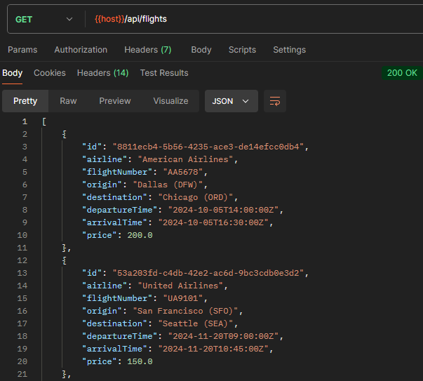
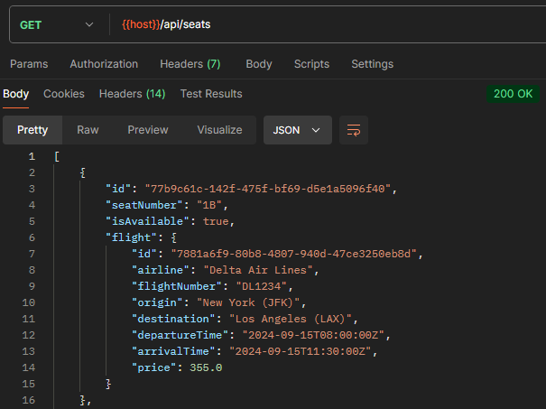
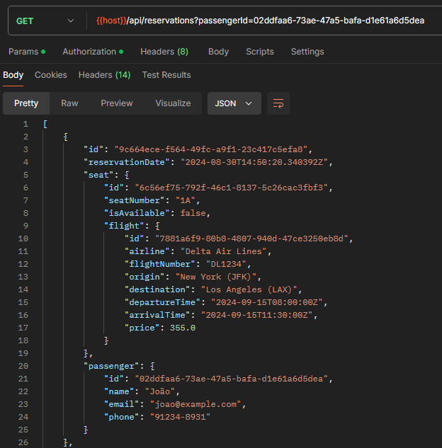
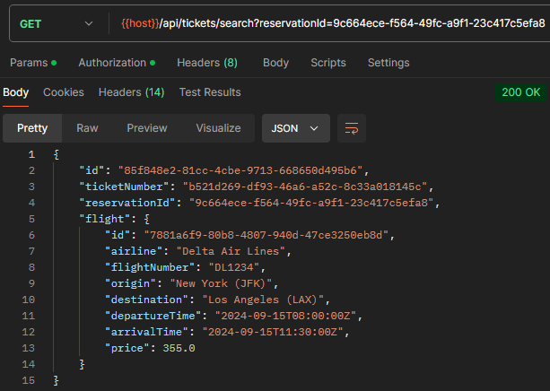
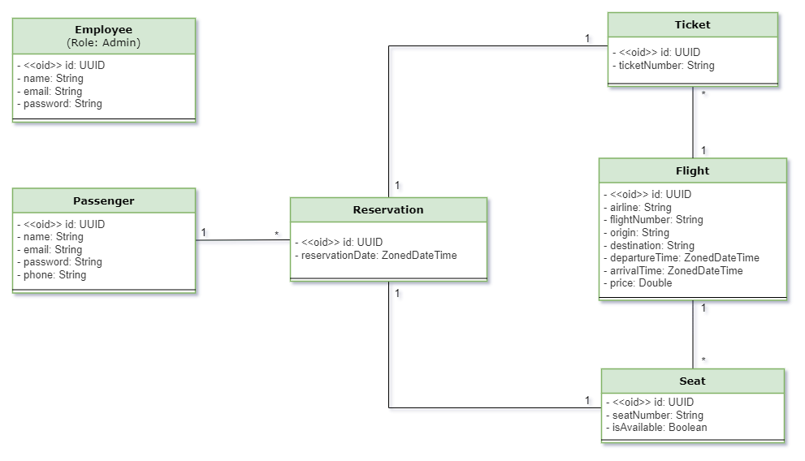
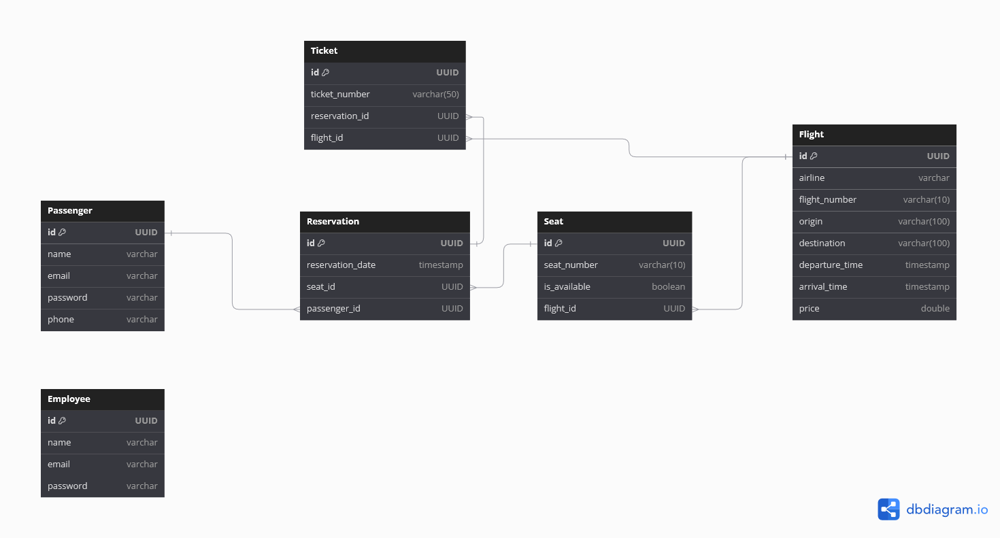

<h1 align="center">
  Airline Ticket Reservation System
</h1>

## ✈️ Projeto

API REST desenvolvida para gerenciar a reserva de passagens aéreas. Através desta API, passageiros podem buscar voos disponíveis, reservar assentos e obter tickets para suas reservas.

## 🛫️ Fluxo de Operações

1. **Buscar Voos Disponíveis**: Passageiros podem procurar os voos disponíveis.
2. **Buscar Assentos Disponíveis**: Após selecionar um voo, o passageiro pode procurar os assentos disponíveis para esse voo específico.
3. **Criar Reserva**: O passageiro cria uma reserva especificando o ID do assento escolhido e o ID do voo.
4. **Criação Automática de Ticket**: Após a reserva ser criada, a disponibilidade do assento é atualizada e um ticket é gerado automaticamente. O ticket inclui o ID da reserva, o número do ticket e o ID do voo.
5. **Consultar Ticket**: O passageiro pode buscar informações sobre o ticket utilizando o ID da reserva.

## 🛩️ Endpoints
**Documentação Local**: http://localhost:8080/swagger-ui/index.html

    
<b>Voos</b>

    

    
<b>Assentos</b>

    

    
<b>Reservas</b>

    

    
<b>Tickets</b>

    

## 💻 Tecnologias
- Linguagem: Java
- Framework: Spring Boot (Web, Jpa, Security)
- Banco de Dados: PostgreSQL
- Maven
- Flyway Migrations
- Java JWT
- JUnit 5
- Mockito

## 🔎 Diagramas

    
Diagrama de Classes

    

    
Diagrama de Entidade e Relacionamento

    

## 🛠️ Configuração e Execução

Pré-requisito: Java 17
1. Clone o repositório
2. Instale as dependências do **pom.xml** com Maven
3. Crie o database no PostgreSQL com as configurações do **application.properties**
4. Execute o **Application.java**

## Autor
Isabel Henrique

https://www.linkedin.com/in/isabel-henrique/